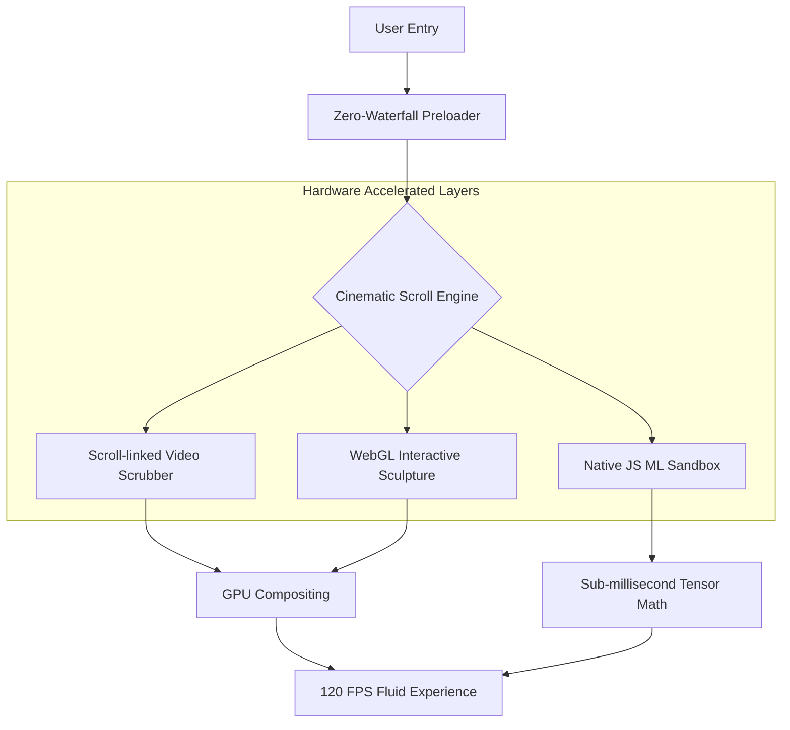

# 🖥️ Mainak Biswas: Creative Technologist & AI Engineer

[](https://vitejs.dev/)
[](https://reactjs.org/)
[](https://www.framer.com/motion/)
[](https://threejs.org/)
[](https://tailwindcss.com/)

> **A highly optimized, cinematic digital portfolio engineered to push the limits of browser performance. Featuring custom WebGL shaders, pure JavaScript Neural Networks, and GPU-accelerated scroll physics.**

---

## 🌟 Overview

This platform serves as the digital identity for **Mainak Biswas**, a Creative Technologist and AI/ML Engineer. It is not a standard web page; it is a meticulously engineered interactive experience designed to demonstrate expertise in bleeding-edge web technologies, real-time 3D rendering, and applied machine learning.

---

## 🚀 Key Engineering Milestones

### 🧠 Native JS Convolutional Neural Network (MNIST Sandbox)
Built a completely custom **TinyCNN inference engine** from scratch in vanilla JavaScript.
- **No TFJS Dependency:** Bypasses heavy WebAssembly payloads, dropping bundle size by megabytes.
- **O(N) Optimization:** Manual convolutional math loops process the 28x28 canvas input in `< 1ms`.
- **Bounding-Box Centering:** Raw pixel analysis automatically centers user drawings before feeding them through the CNN weights for drastically improved accuracy.

### 🎥 Cinematic Scroll Physics
- **Lenis Engine:** Hijacked native scroll events and routed them through a unified `requestAnimationFrame` loop with a highly tuned `lerp: 0.05`.
- **Hardware Acceleration:** Aggressive use of `will-change: transform, opacity` and `translateZ(0)` forces the browser to offload heavy typography animations to dedicated GPU VRAM.
- **Zero-Waterfall Preloading:** Massive video assets and 3D STL models are aggressively preloaded in the `index.html` header, ensuring instant time-to-interact.

### 🧊 High-Performance WebGL (Interactive Sculpture)
- **Zero-Alpha Compositing:** Disabled DOM alpha blending (`alpha: false`) within the WebGL canvas. By preventing the browser from computing transparency against the background DOM, rendering performance skyrocketed by ~30%.
- **DPR Clamping:** Hard-capped Device Pixel Ratio scaling on Retina displays to guarantee 60-120 FPS during 3D camera pan movements.

---

## 🛠️ Project Showcases

### [CytoGraph ML](https://github.com/fs0cietyx/CytoGraph-ML)
* **Category:** AI / Machine Learning
* **Focus:** Advanced graph neural networks applied to cellular structures.

### [Maze Crawler: Strategic AI Agent](https://github.com/fs0cietyx/maze-crawler)
* **Category:** Algorithms / Pathfinding
* **Focus:** Implements optimized A* pathfinding and real-time collision avoidance matrices.

### [AI Slop Detector](https://github.com/fs0cietyx/ai-slop-detector)
* **Category:** AI Governance / NLP
* **Focus:** High-efficiency text classification for detecting synthetically generated generic content.

---

## 🏗️ System Architecture



---

## 🚀 Installation & Deployment

### 1. Local Setup
```bash
# Clone the repository
git clone https://github.com/fs0cietyx/mainak-studio-v2.git
cd mainak-studio-v2

# Install dependencies
npm install
```

### 2. Development & Build
```bash
# Start local development server on port 3000
npm run dev -- --port 3000

# Build for production
npm run build
```

### 3. Neural Network Retraining
If you wish to retrain the CNN weights used in the sandbox:
```bash
# Requires Python 3.10+ and PyTorch
python train_cnn.py
```
This script will output a highly optimized `cnn_weights.json` file.

---

<p align="center">
  <i>"It works on my machine"</i><br>
  <b>© 2026 Mainak Biswas</b>
</p>
