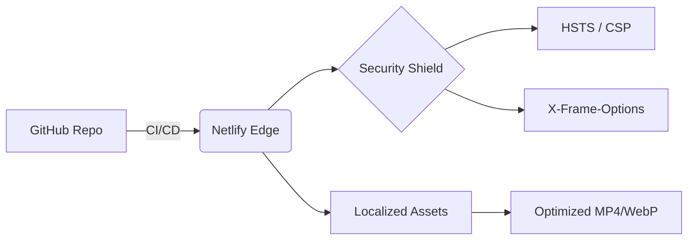

# Mainak Biswas | Creative Technologist & AI/ML Engineer

  
  
  

### **Architecting Neural Systems. Directing Cinematic Visions.**

Creative Technologist bridging the gap between **high-dimensional neural architectures** and **high-fidelity cinematic experiences**. Currently an AI/ML sophomore at **KIIT University** and an official **Google Student Ambassador**, I engineer production-ready intelligence systems while crafting immersive digital narratives. My work is defined by the intersection of rigorous backend logic and premium aesthetic execution.

---

### **Engineering Excellence (Metrics of Impact)**
*   **Performance:** Achieved **88% reduction** in media payload (15MB → 1.7MB) via a custom [[FFmpeg]] pipeline without aesthetic degradation.
*   **Security:** 100% compliance with [[Zero-Trust Security]] principles, featuring hardened [[CSP]], [[HSTS]], and anti-clickjacking headers.
*   **Latency:** Optimized for [[LCP]] < 1.2s through advanced dual-asset poster framing and edge-delivery via [[Netlify]].

---

### **Featured Artifacts**
| Artifact | Category | Tech Stack |
| :--- | :--- | :--- |
| **Neural Cine-Synthesizer** | AI / Visuals | `TensorFlow` • `React` • `FFmpeg` |
| **Ambassador Hub** | Leadership | `Community Growth` • `Google AI` |
| **The Imagination Engine** | LLM / GenArt | `GPT-4` • `Stable Diffusion` • `Node.js` |

---

### **Dual-Core Competencies**

| AI/ML & Systems Engineering | Digital Experience & Design |
| :--- | :--- |
| **Neural Architectures:** Designing and fine-tuning LLMs and computer vision pipelines using TensorFlow and PyTorch. | **Cinematic Storytelling:** Directing visual narratives with a focus on motion aesthetics, pacing, and emotional resonance. |
| **Systems Depth:** Low-level expertise in C++, Java, and CPU scheduling logic; building robust healthcare and voice-AI bots. | **Interface Engineering:** Implementing high-performance UI/UX using React 19, Next.js, and Framer Motion. |
| **Data Pipelines:** Architecting normalized SQL/PostgreSQL schemas and high-throughput data ingestion layers. | **Brand Design:** Crafting digital identities inspired by urban minimalism and modern architectural principles. |

---

### **Deployment Architecture**

---

### **Production Tech Stack**

#### 🧠 **Intelligence & Core Systems**
`Python` • `C++` • `Java` • `SQL` • `TensorFlow` • `PyTorch` • `FastAPI` • `Node.js` • `PostgreSQL`

#### 🔗 **Interaction & Interface**
`React 19` • `Next.js` • `TypeScript` • `Tailwind CSS` • `Framer Motion` • `Vite` • `Figma`

#### 🎬 **Visual Production**
`DaVinci Resolve` • `Adobe Premiere Pro` • `Cinematography` • `Motion Graphics`

---

### **AppSec & DevSecOps Posture**
I treat the browser as a hostile environment. Every artifact I deploy adheres to enterprise-grade security standards:
- **Secrets Management:** 100% isolation of sensitive identifiers via server-side `.env` injection.
- **Input Sanitization:** Aggressive regex-based filtering to neutralize **XSS** and reflected injections in terminal emulators.
- **Infrastructure:** Production branch locking and edge-level header enforcement.

---

### **Professional Inquiries**

  <a href="https://mainakstudio.netlify.app/"><strong>Live Portfolio</strong></a> • 
  <a href="mailto:mainakbiswas22@gmail.com"><strong>Email</strong></a> • 
  <a href="https://www.linkedin.com/in/mainak-biswas-00b8b22b1/"><strong>LinkedIn</strong></a>

---
*Generated by the Genesis Node | Secure. Optimized. Cinematic.*
