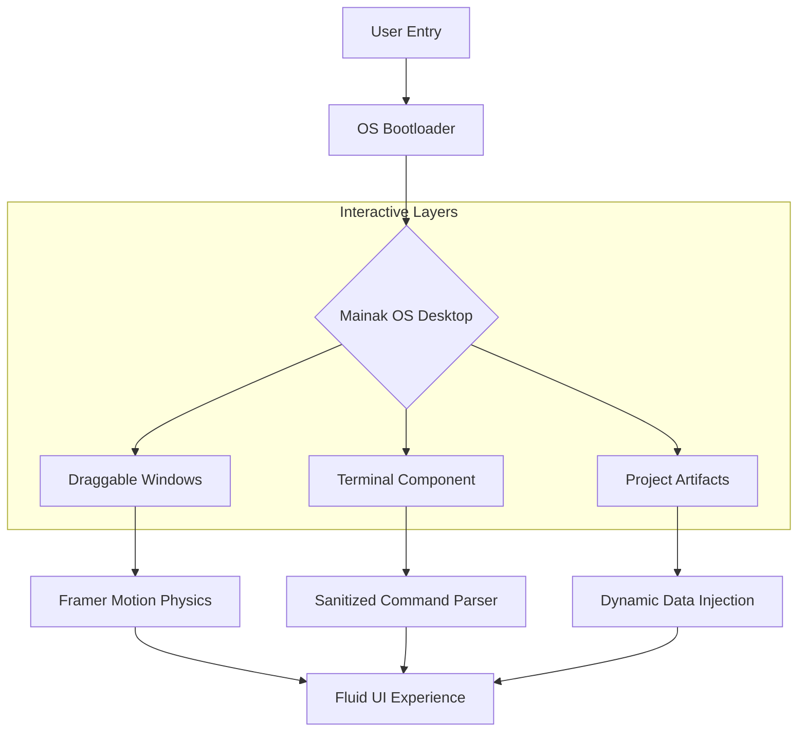

# 🖥️ Mainak-OS: Cinematic Portfolio Experience

[](https://vitejs.dev/)
[](https://reactjs.org/)
[](https://www.framer.com/motion/)
[](https://tailwindcss.com/)

> **A high-performance, GPU-accelerated digital ecosystem designed to showcase the technical expertise and creative milestones of Mainak Biswas.**

---

## 🌟 Overview

**Mainak-OS** is a sophisticated "Creative Technologist" identity hub. Engineered with a focus on cinematic aesthetics and fluid motion, it provides a unique macOS-inspired desktop experience where users can interact with draggable windows, explore high-fidelity projects, and view a validated history of engineering achievements.

---

## 🛠️ Project Showcases

### [Maze Crawler: Strategic AI Agent](https://github.com/fs0cietyx/maze-crawler)
*   **Engineering:** Implements optimized A* pathfinding and real-time collision avoidance matrices.
*   **Strategy:** Features dynamic survival heuristics that scale with the game's scrolling ramp.
*   **Result:** Deployed as a high-performance system for the Google Maze Crawler competition.

### [GitHub Profile Optimization](https://github.com/fs0cietyx)
*   **Automation:** Custom suite of tools and GitHub Actions for real-time performance tracking.
*   **Visualization:** Advanced contribution mapping and metric generation.

---

## 🏗️ System Architecture

The application is built on a modular React architecture, utilizing spring-based physics for window management and interactive artifacts.



---

## 📊 Technical Excellence

| Layer | Technologies |
| :--- | :--- |
| **Framework** | React 18 (TypeScript) |
| **Build Tool** | Vite |
| **Animation** | Framer Motion (GPU-Accelerated) |
| **Styling** | TailwindCSS, PostCSS |
| **Security** | Strategic Frontend Protocol, PII Encoding |
| **Deployment** | Netlify (Automated CI/CD) |

### Key Aesthetic Features
*   **Glassmorphism:** High-contrast lighting and frost-glass blurs for a premium experience.
*   **Tactile Physics:** Draggable windows with realistic spring-based transitions.
*   **Interactive Terminal:** A fully functional, sanitized command-line interface for exploratory navigation.

---

## 🚀 Installation & Deployment

### 1. Local Setup
```bash
# Navigate to the app directory
cd personal-landing-page/app

# Install dependencies
npm install

# Configure environment
cp .env.example .env  # Add your VITE_ variables here
```

### 2. Development & Build
```bash
# Start local development server
npm run dev

# Build for production
npm run build
```

---

## 🔒 Security & Integrity
This application adheres to the **Strategic Frontend Protocol**, ensuring:
*   **Zero-Trust Mandate:** No PII exists as plain text in the source code; identifiers are Base64-encoded and decoded at runtime.
*   **Input Sanitization:** All terminal commands are parsed through a strict schema to prevent reflected XSS.

---
**Author:** [Mainak Biswas/fs0cietyx]  
**Project Status:** `Fully Operational / Live`
