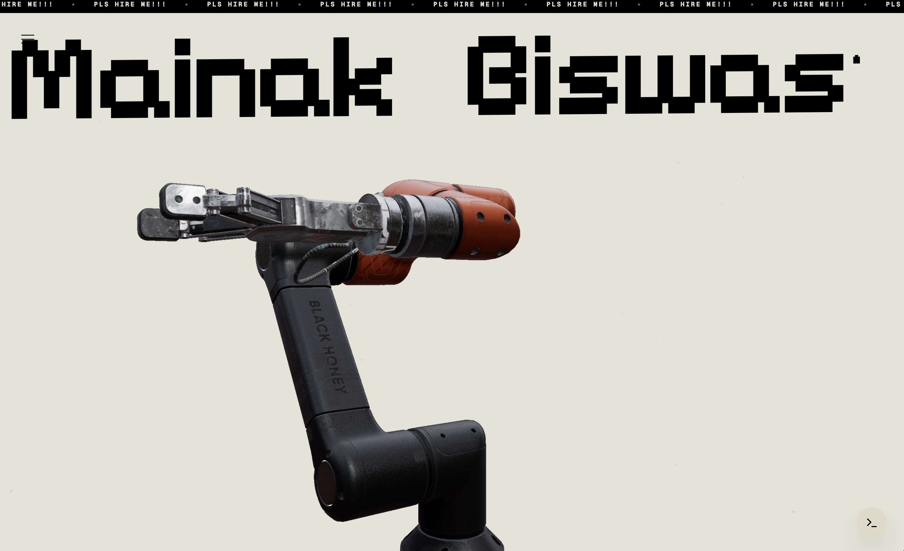
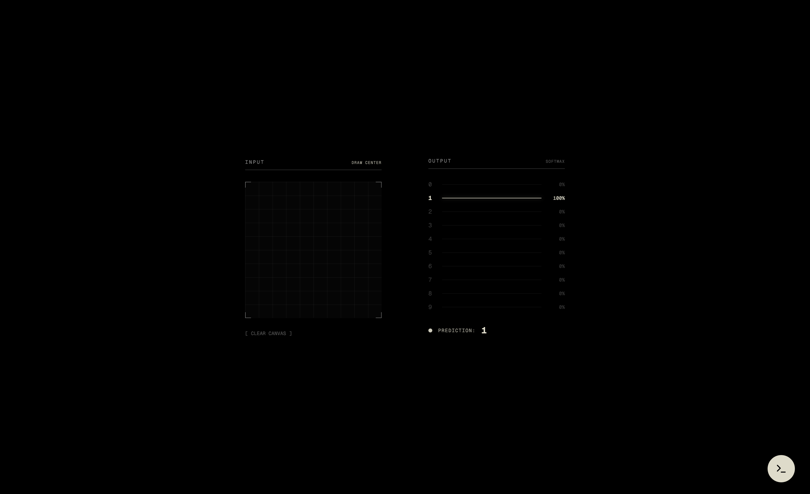

# Mainak Studio v2

A highly optimized digital portfolio engineered to demonstrate advanced browser performance, zero-waterfall architecture, and complex 3D rendering. The application features custom WebGL shaders, a native JavaScript Convolutional Neural Network (CNN), GPU-accelerated scroll physics, and an interactive simulated terminal environment.

## Architecture & Visual Overview

<p align="center">
  
  
</p>
<p align="center">
  
  
</p>
<p align="center">
  <em>Core interfaces demonstrating 3D rendering, machine learning inference, and terminal emulation.</em>
</p>

## Tech Stack

- **Language**: TypeScript
- **Framework**: React 19
- **Build System**: Vite 6
- **3D Engine**: Three.js / React Three Fiber / Drei
- **Animation & Physics**: Framer Motion, Lenis (Scroll hijacking)
- **Styling**: Tailwind CSS
- **Deployment**: Netlify

## Key Technical Implementations

- **Cinematic Scroll Engine**: Native scroll events are intercepted via Lenis and routed through a unified `requestAnimationFrame` loop. This enables precise linear interpolation and consistent scrolling velocity regardless of input device.
- **Hardware Acceleration**: Heavy typography and DOM elements utilize `will-change: transform` and `translate3d` to offload rendering to dedicated GPU VRAM, ensuring 60fps performance during complex 3D transitions.
- **Zero-Waterfall Preloading**: Core Three.js logic and heavy assets are dynamically imported via `React.lazy` and `Suspense` boundaries, guaranteeing an instant initial page load (Time to Interactive).
- **Native JavaScript CNN**: A proprietary TinyCNN inference engine built from scratch in vanilla JavaScript. It processes raw HTML5 Canvas matrix inputs in `< 1ms` without relying on external libraries like TensorFlow.js.
- **Vite Glob Imports**: Static assets (such as the 45MB case study image directory) are processed at build-time using `import.meta.glob`. This guarantees cryptographic hashing and prevents CDN 404 cache misses in production environments like Netlify.

## Prerequisites

- Node.js 20.x or higher
- npm

## Getting Started

### 1. Clone the Repository

```bash
git clone https://github.com/fs0cietyx/mainak-studio-v2.git
cd mainak-studio-v2
```

### 2. Install Dependencies

```bash
npm install
```

### 3. Local Development

```bash
npm run dev -- --port 3000
```
Navigate to `http://localhost:3000` to view the application.

## Directory Structure

```text
├── public/                 # Static assets (3D models, fonts, images)
│   ├── case-studies/       # Image directory for the parallax grid
│   └── snapshots/          # Documentation assets
├── ml-research/            # Python scripts for training Neural Networks
│   ├── train_cnn.py
│   └── train_mnist.py
├── src/
│   ├── components/         # React components (Hero, Terminal, MLLab)
│   ├── utils/              # Helper functions (e.g., security.ts for PII)
│   ├── App.tsx             # Application routing and initialization
│   └── main.tsx            # DOM mounting
├── netlify.toml            # Deployment and CSP headers configuration
└── vite.config.ts          # Build configuration and chunk splitting logic
```

## Security & Maintenance Protocol

To maintain zero-trust security and maximum performance, the following constraints are enforced:

1. **Zero-Trust Data Protection**: Personally Identifiable Information (PII) such as email addresses and phone numbers must never exist in plain text. They are stored as Base64 encoded environment variables and decoded at runtime via `src/utils/security.ts`.
2. **Build Optimization**: The `vite.config.ts` utilizes custom Rollup `manualChunks` to isolate `@react-three` and `three` from the core application logic. This circumvents 500kb chunk limits and guarantees optimal caching.
3. **Deployment Consistency**: All merges to `main` must pass the local `npm run build` process to ensure the asset pipeline remains intact before Netlify triggers the CI/CD pipeline.

## Environment Variables

| Variable | Description |
| -------- | ----------- |
| `VITE_CONTACT_EMAIL` | Base64 encoded email address |
| `VITE_CONTACT_PHONE` | Base64 encoded phone number |

## Available Scripts

| Command | Description |
| ------- | ----------- |
| `npm run dev` | Initialize the local development server |
| `npm run build` | Execute TypeScript compiler and generate optimized production bundle |
| `npm run preview` | Serve the `/dist` directory locally to emulate production |
| `npm run lint` | Execute ESLint for static code analysis |

## Neural Network Model Retraining

The machine learning weights utilized by the JavaScript inference engine can be retrained. This requires Python 3.10+ and PyTorch.

```bash
cd ml-research
python train_cnn.py
```
This script generates an optimized `cnn_weights.json` file which should be copied into the application logic.

## Deployment

The repository is configured for automated deployment via Netlify. The pipeline utilizes the configuration defined in `netlify.toml`.

### Automated Pipeline
1. Push commits to the `main` branch.
2. Netlify provisions a Node 20 environment.
3. The `npm run build` command is executed.
4. The generated `dist` directory is published and distributed across the edge network.
