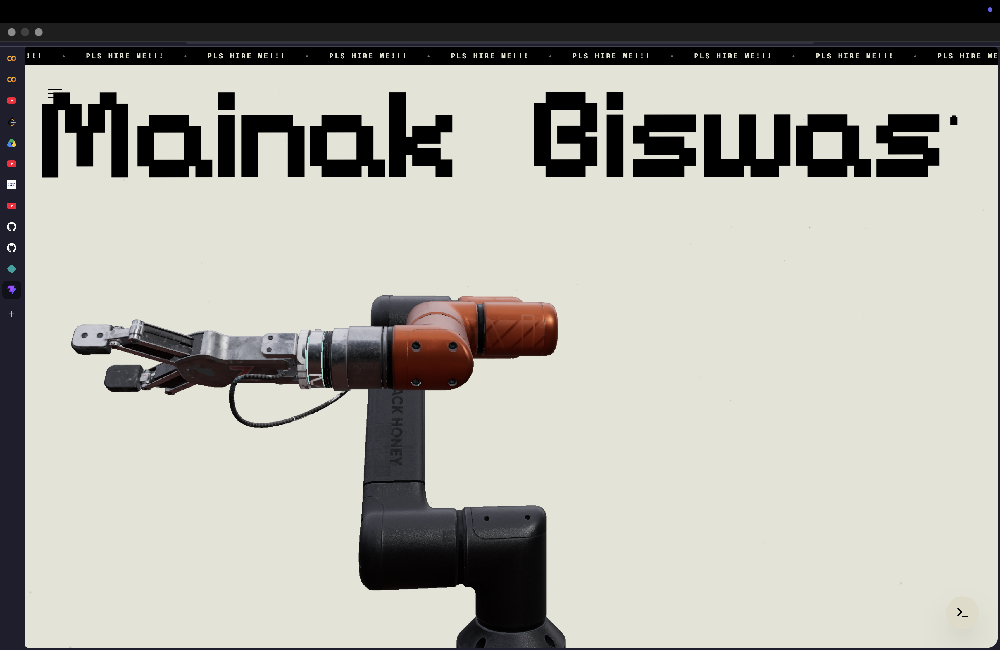

# 🖥️ Mainak Studio v2

An absurdly optimized, cinematic digital portfolio engineered to push the limits of browser performance. It features custom WebGL shaders, pure JavaScript Neural Networks, GPU-accelerated scroll physics, and a fully interactive simulated OS terminal.

## ✨ Visual Experience


*The high-end hero section featuring cinematic scroll physics and dynamic lighting.*

<p align="center">
  
  
</p>
<p align="center">
  
  
</p>
<p align="center">
  <em>An absurdly optimized, cinematic digital portfolio engineered to push the limits of browser performance.</em>
</p>

## Key Features

- **Cinematic Scroll Engine**: Hijacks native scroll events using Lenis, routed through a unified `requestAnimationFrame` loop with tuned linear interpolation.
- **Hardware Acceleration**: Aggressive use of `will-change` and `translateZ(0)` offloads heavy typography animations to dedicated GPU VRAM.
- **Zero-Waterfall Preloading**: Lazy loading code-splits the heavy Three.js logic to guarantee instant time-to-interact.
- **Native JS Convolutional Neural Network**: A completely custom TinyCNN inference engine built from scratch in vanilla JavaScript (no TFJS dependency) that processes canvas input in `< 1ms`.
- **Integrated Terminal**: Fully functional simulated terminal (`Mainak OS`) hidden in the UI for developers to explore the ecosystem.

---

## Tech Stack

- **Language**: TypeScript
- **Framework**: React 19
- **Build Tool**: Vite 6
- **3D Engine**: Three.js / React Three Fiber / Drei
- **Animations**: Framer Motion & Lenis
- **Styling**: Tailwind CSS
- **Deployment**: Netlify

---

## Prerequisites

- Node.js 20 or higher
- npm (default package manager)

---

## Getting Started

### 1. Clone the Repository

```bash
git clone https://github.com/fs0cietyx/mainak-studio-v2.git
cd mainak-studio-v2
```

### 2. Install Dependencies

```bash
npm install
```

### 3. Start Development Server

```bash
npm run dev -- --port 3000
```
Open [http://localhost:3000](http://localhost:3000) in your browser.

---

## Architecture

### Directory Structure

```text
├── public/                 # Static assets (3D models, fonts, images, videos)
│   ├── case-studies/       # App case study media
│   └── snapshots/          # Documentation screenshots
├── ml-research/            # Python scripts for training Neural Networks
│   ├── train_cnn.py
│   └── train_mnist.py
├── src/
│   ├── components/         # Reusable React components (Hero, Terminal, MLLab)
│   ├── utils/              # Helper functions (security.ts for PII masking)
│   ├── App.tsx             # Main entry point & routing
│   └── main.tsx            # DOM initialization
├── netlify.toml            # Netlify deployment and CSP headers configuration
└── vite.config.ts          # Vite build configuration & chunk splitting
```

### Strategic Frontend Protocol: Maintenance Gateway

This application is hardened under a strict maintenance protocol to ensure it remains a high-performance, zero-trust web asset.

1. **Cinematic Performance Mandate**
   - **Framer Motion Precision:** Every interaction must be fluid. All `drag` constraints must be pixel-perfect.
   - **Zero Layout Shift:** Use absolute positioning and pre-calculated aspect ratios for all hero assets.
   - **Image Optimization:** All background gradients and placeholders must be CSS-generated or WebP-optimized.

2. **Zero-Trust Security Mandate**
   - **No Hardcoded PII:** Contact information (Email/Phone) must never exist as plain text in the source.
   - **Base64 Masking:** Use the `security.ts` utility to decode identifiers only at runtime.
   - **Env Consistency:** Any new `VITE_` variable must be mirrored in the Netlify dashboard immediately.

3. **Deployment Protocol**
   - **Build Isolation:** Do not modify the `dist` folder directly. All changes must originate from the `src` layer.
   - **CI/CD Integration:** Merges to `main` must pass the local build check (`npm run build`) to ensure Netlify stability.

---

## Environment Variables

This project uses environment variables to adhere to the Zero-Trust Security mandate. 

| Variable | Description |
| -------- | ----------- |
| `VITE_CONTACT_EMAIL` | Base64 encoded email address (decoded at runtime) |
| `VITE_CONTACT_PHONE` | Base64 encoded phone number (decoded at runtime) |

---

## Available Scripts

| Command | Description |
| ------- | ----------- |
| `npm run dev` | Start development server |
| `npm run build` | Compile TypeScript and build for production |
| `npm run preview` | Serve the production build locally |
| `npm run lint` | Run ESLint to check for code quality |

### Neural Network Retraining

If you wish to retrain the CNN weights used in the sandbox:
```bash
# Requires Python 3.10+ and PyTorch
cd ml-research
python train_cnn.py
```
This script will output a highly optimized `cnn_weights.json` file.

---

## Deployment

This project is configured to auto-deploy to **Netlify** via `netlify.toml`.

### Automated Deployment (Recommended)
1. Push your changes to the `main` branch.
2. Netlify will automatically trigger a build using Node 20.
3. The build command `npm run build` is executed.
4. The `/dist` directory is published.

### Manual Local Build Check
Before pushing to production, always verify the build succeeds without chunk size limits breaking the 3D engine:
```bash
npm run build
```
*Note: We utilize custom Rollup manualChunks in `vite.config.ts` to cleanly separate Three.js from React Fiber logic, ensuring chunk sizes remain within optimized browser limits.*

---

<p align="center">
  <i>"It works on my machine"</i><br>
  <b>© 2026 Mainak Biswas</b>
</p>
